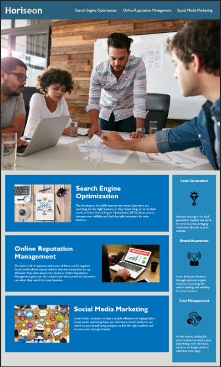

# Week_one_homework
## Week one home work project

For our first weeks project, we were given html and css code for a completed website. The code however, was not 100%. Some things didnt work, some things were missing and some things needed to be altered to be essentially better code with the same results.

## This is the end result

## My contribution
This project was a fantastic introduction to refractoring code, learning semantic html and debugging. It gave me motivation to learn a host of new skills but also, how to look at code from different points of view. I learnt to view code how somebody who may have a disability would view it which was interesting and important. I learnt to use the process of elimination to locate problems and fix them. Learning to consolidate made my code look neater, producing the same results and also optimizing performance of the site.

One issue I did have early on which was part of the assignment was regular commits and pushes to my git hub account. I had an error that i was unsure how to fix so i did complete a large portion of my work before being able to push it. This error has however got me to put practice into my terminal skills to overcome for future projects. 

**These are changes i have made to improve the code on the html and css files provided**
--Faults found--
1. search engine optimization link not connected, fixed link by adding id tag
2. added alt tags to all images in case image does not load or for screen reader use 
3. removed img end tag as not needed 
4. Removed addition Div end tags 
5. Changed title to match website for browser tab use
6. Replaced div tags with header, nav, article, aside and footer tags to add semantic html
7. Consolidated a large amount of css code so html code with identical styling can use same css code instead of repeating itself. 
8. added meta tag for use on mobile devices
